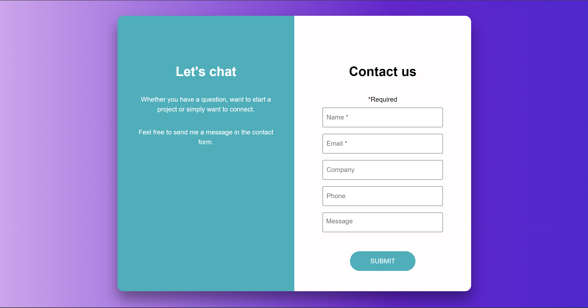

# Contact form
## About the project
It's a contact form build with Angular. I coded it as a learning project. 

## Features
* fully responsive design
  * two cards displayed next to each other on dekstop
  * which changes to one below the other on mobile devices, 
* clearing the form after submission,
* Visually pleasing styling with CSS.

## Link
[https://witchdevelops.github.io/Angular-contact-form/](https://witchdevelops.github.io/Angular-contact-form/)

## Screenshot

## What I learned
* how to use Angular
* how to dispplay two divs next to each other or one on top of the other, depending on the screen size

## What I would do differently if I had to redo it
* added client-size form validation with JS, to highligh field with invalid input
* added animation to input fields
* figured out how to catch user input, store it locally and send to an email or a spreadsheet (will it require learning PHP?).
